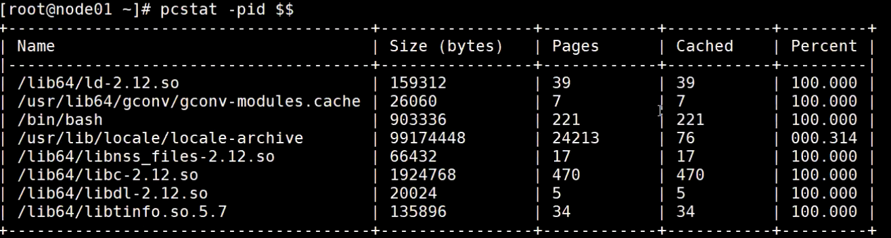

<!--more-->

 **VFS、FD、PageCache、Kernel** 是 Linux 内核 I/O 子系统中非常核心的几个概念，它们彼此之间有明确的逻辑关系。下面我将逐一解释，并结合一个整体视角说明它们之间的关系。

------

## 🔍 1. 各自定义与作用

### ✅ VFS（Virtual File System）虚拟文件系统

- VFS 是 Linux 提供的**统一的文件系统抽象接口层**。
- 不管你是用的是 ext4、xfs 还是 nfs，VFS 提供了统一的操作接口，比如 open、read、write、close。
- 作用：**屏蔽不同底层文件系统实现差异**，对上层（如用户程序）提供一致的 API。

------

### ✅ FD（File Descriptor）文件描述符

- FD 是用户态访问文件、socket、管道等资源的**索引句柄**。
- 每当你 `open()` 一个文件，内核会返回一个 FD（整数）。
- FD 本质是进程级的一个整数索引，指向 `struct file*` 结构体。
- 是用户空间进入 VFS 层的**入口**。

------

### ✅ PageCache（页缓存）

- 是 Linux 内核中一块用于缓存**文件数据页**的内存区域。
- 当你通过 `read()` 读取文件时，数据先从 PageCache 查找，**命中则避免磁盘 I/O**，加速访问。
- 当写文件时，也先写入 PageCache，之后由内核后台 `flush` 到磁盘（写回机制）。
- 属于 Linux 的 **统一缓存机制（unified page cache）**。

------

### ✅ Kernel（Linux 内核）

- Kernel 是整个系统的**核心管理层**，VFS、PageCache、内存、进程调度、I/O 子系统等都运行在其中。
- Kernel 提供系统调用（syscall）接口让用户空间进程访问资源。
- VFS、PageCache、FD 都是 Kernel 模块的组成部分。

------

## 🔁 2. 它们之间的关系（从调用链角度）

### 🌐 用户进程访问文件数据流程（简化版）：

```

用户态程序
   |
open("file.txt") → 得到 FD（如 3）
   |
read(fd, buf, size) → 调用 syscall
   |
⬇
[Linux Kernel]
   |
→ 通过 FD 查找 struct file*
   |
→ VFS 层处理：根据文件系统类型（ext4/xfs/nfs）调用对应实现
   |
→ 查找页缓存（PageCache）是否有该页
    ├─✅ 命中 → 从内存读取 → 返回给用户
    └─❌ 未命中 → 发起 block device I/O（从磁盘读取）→ 填充 PageCache → 返回数据
```

------

## 📌 简明逻辑链总结

| 概念          | 所属层级      | 主要作用                        | 与其他组件关系                                   |
| ------------- | ------------- | ------------------------------- | ------------------------------------------------ |
| **FD**        | 用户态 / 内核 | 用户访问文件的句柄（索引）      | 指向内核 `file*` 结构体，通过它进入 VFS          |
| **VFS**       | 内核          | 提供统一文件访问抽象接口        | 接收来自 FD 的请求，路由到实际文件系统           |
| **PageCache** | 内核          | 文件数据的缓存层，提升 I/O 性能 | 被 VFS 层查询或更新，缓存数据页                  |
| **Kernel**    | 内核          | 承载一切管理功能                | 容纳并调度所有组件，如 VFS、PageCache、block I/O |


------

## 📌 举个例子帮助理解

你运行以下代码：

```
c


int fd = open("a.txt", O_RDONLY);
char buf[100];
read(fd, buf, 100);
```

发生了什么？

1. `open()` → Kernel 创建 `file*`，返回 FD；
2. `read()` → 根据 FD 找到 `file*`；
3. VFS → 确认该文件属于 ext4；
4. 查 PageCache 看有没有数据页；
5. 没有的话 → 发起 disk read → 填 PageCache；
6. 将数据拷贝到 `buf[]`；
7. 用户态读取完成。

------

## 🧠 拓展理解

| 类别          | 关键点                                                 |
| ------------- | ------------------------------------------------------ |
| 异步写        | 写数据时不会立刻写磁盘，而是写到 PageCache，稍后 flush |
| Direct I/O    | 绕过 PageCache，直接对 block device 进行 I/O           |
| mmap 映射文件 | 也是通过 PageCache 映射页访问文件                      |


------

结合 Linux 系统的 `/proc`、`/sys/fs`、`vmstat` 等命令来查看内存、文件系统、虚拟内存和进程调度等关键内核结构的“实地状态”。

------


### 🧠 理解 Linux 内核资源结构（配合 /proc、/sys、vmstat）：

```
lua


+----------------------------+
|        应用用户层         |
+-------------+--------------+
              |
              v
+-------------+--------------+
|        Linux 内核层        |
|                            |
|  +---------+   +---------+ |
|  | 进程调度 |   | 内存管理 | <--- /proc/[pid]/sched, /proc/meminfo
|  +---------+   +---------+ |
|      |              |      |
|      v              v      |
|  +--------+     +--------+ |
|  | /proc  |     | /sys/fs| <--- 虚拟文件系统接口，供用户态读取系统信息
|  +--------+     +--------+ |
+----------------------------+
```

------

## 🧪 典型命令实地查看

### 1. `/proc`：虚拟内存和进程信息（从内核导出）

#### 💡 结构示意

```


/proc
├── meminfo           ← 内存使用情况
├── vmstat            ← 虚拟内存统计
├── loadavg           ← 系统负载
├── [pid]/
│   ├── status        ← 单个进程状态
│   ├── sched         ← 调度器统计
│   └── cmdline       ← 启动命令
```

#### 🔍 示例

```


cat /proc/meminfo | head
makefile


MemTotal:       16338044 kB
MemFree:         1305428 kB
Buffers:          384684 kB
Cached:         10674876 kB
SwapTotal:       2097148 kB
SwapFree:        2097148 kB


cat /proc/1/status  # 查看 PID=1 的进程状态
```

------

### 2. `/sys/fs`：内核子系统的配置接口

- `/sys/fs/cgroup`: 控制组 (cgroup) 子系统的挂载点，展示进程组资源限制
- `/sys/fs/bpf`: BPF 程序和 map 信息

```


tree /sys/fs/cgroup -L 2
```

可见 CPU、memory、io 限制情况。

------

### 3. `vmstat`：动态内存 & swap & IO 状态

```

vmstat 1 5
```

#### 🧾 输出示意

```

procs -----------memory---------- ---swap-- -----io---- -system-- ------cpu-----
 r  b   swpd   free   buff  cache   si   so    bi    bo   in   cs us sy id wa st
 1  0      0  53020  31124 824204    0    0     1     2    3    6  1  0 99  0  0
```

字段解释：

- `r`: 可运行进程数量（run queue）
- `si/so`: swap in/out
- `us/sy`: 用户/系统态 CPU 使用率
- `wa`: IO 等待时间

------

## 📊 可视化建议（ASCII 风格）

### Linux 虚拟内存结构：

```
pgsql


+--------------------------+
|         内核空间         |
+--------------------------+
|         用户空间         |
|  +--------+             |
|  | Stack  | ← 向下增长    |
|  +--------+             |
|  | Heap   | ← 向上增长    |
|  +--------+             |
|  | Data   |             |
|  +--------+             |
|  | Text   |             |
+--------------------------+
```

------

### 🚀 示例实战：查看当前系统负载和内存健康度

```


cat /proc/loadavg
```

输出：

```
yaml


0.05 0.03 0.01 1/135 1342
```

表示最近 1、5、15 分钟负载；`1/135` 表示正在运行的线程数/总线程数。

------

## ✅ 小结

| 工具/目录 | 查看内容                     | 常用命令示例                                  |
| --------- | ---------------------------- | --------------------------------------------- |
| `/proc`   | 内核导出的运行时信息         | `cat /proc/meminfo`、`cat /proc/[pid]/status` |
| `/sys/fs` | 文件系统、cgroup、BPF 等接口 | `tree /sys/fs/cgroup`                         |
| `vmstat`  | 运行时资源状态快照           | `vmstat 1 5`                                  |


# 其他笔记

查看文件源信息

```
[rust@localhost ~]$ stat ooxx.txt
  File: ‘ooxx.txt’
  Size: 0         	Blocks: 0          IO Block: 4096   regular empty file
Device: 803h/2051d	Inode: 2554752     Links: 1
Access: (0664/-rw-rw-r--)  Uid: ( 1000/    rust)   Gid: ( 1000/    rust)
Context: unconfined_u:object_r:user_home_t:s0
Access: 2025-05-17 22:00:33.642686670 -0700
Modify: 2025-05-17 22:00:33.642686670 -0700
Change: 2025-05-17 22:00:33.642686670 -0700

#软链接 Inode 不一样
[rust@localhost ~]$ ln -s ooxx.txt zxj.txt
[rust@localhost ~]$ ll
total 0
drwxr-xr-x. 2 rust rust 6 May 17 09:17 Desktop
drwxr-xr-x. 2 rust rust 6 May 17 09:17 Documents
drwxr-xr-x. 2 rust rust 6 May 17 09:17 Downloads
drwxr-xr-x. 2 rust rust 6 May 17 09:17 Music
-rw-rw-r--. 1 rust rust 0 May 17 22:00 ooxx.txt
drwxr-xr-x. 2 rust rust 6 May 17 09:17 Pictures
drwxr-xr-x. 2 rust rust 6 May 17 09:17 Public
drwxr-xr-x. 2 rust rust 6 May 17 09:17 Templates
drwxr-xr-x. 2 rust rust 6 May 17 09:17 Videos
lrwxrwxrwx. 1 rust rust 8 Aug  2 21:35 zxj.txt -> ooxx.txt

```


```
# 1. 创建镜像
dd if=/dev/zero of=mydisk.img bs=1M count=100

# 2. 关联 loop 设备（系统自动选）
sudo losetup -fP mydisk.img

# 3. 查看哪个 loop 设备关联上了
losetup -a

# 假设是 /dev/loop0，执行格式化
sudo mkfs.ext4 /dev/loop0

# 4. 创建挂载点
mkdir ~/mnt/mydisk

# 5. 挂载
sudo mount /dev/loop0 ~/mnt/mydisk

# 6. 查看挂载状态
mount | grep mydisk

# 7. 进入文件系统
cd ~/mnt/mydisk

```


```
[rust@localhost ~]$ lsof -p $$
COMMAND   PID USER   FD   TYPE DEVICE  SIZE/OFF     NODE NAME
    12591 rust  cwd    DIR    8,3      4096       70 /home/rust
    12591 rust  rtd    DIR    8,3       224       64 /
    12591 rust  txt    REG    8,3    964608 50417832 /usr/bin/
    12591 rust  mem    REG    8,3     61624   146973 /usr/lib64/libnss_files-2.17.so
    12591 rust  mem    REG    8,3 106075056 17098588 /usr/lib/locale/locale-archive
    12591 rust  mem    REG    8,3   2151672   146955 /usr/lib64/libc-2.17.so
    12591 rust  mem    REG    8,3     19288   146961 /usr/lib64/libdl-2.17.so
    12591 rust  mem    REG    8,3    174576   167495 /usr/lib64/libtinfo.so.5.9
    12591 rust  mem    REG    8,3    163400   146948 /usr/lib64/ld-2.17.so
    12591 rust  mem    REG    8,3     26254 33901061 /usr/lib64/gconv/gconv-modules.cache
    12591 rust    0u   CHR  136,2       0t0        5 /dev/pts/2
    12591 rust    1u   CHR  136,2       0t0        5 /dev/pts/2
    12591 rust    2u   CHR  136,2       0t0        5 /dev/pts/2
    12591 rust  255u   CHR  136,2       0t0        5 /dev/pts/2
```


### ✅ 1. 什么是 `pcstat`？

`pcstat`（Page Cache stat）是一个用于查看某个文件在 Linux 页缓存（Page Cache）中占比情况的工具，通常用来分析哪些文件在内存中、哪些不在。它**不支持直接用 `-pid` 查看进程页缓存**，你可能想用的其实是别的命令。

------

### ✅ 2. 你可能真正想用的是：

如果你想查看当前 **进程** 使用的内存信息，可以使用以下更常用和内置的方式：

#### 📌 方法一：`cat /proc/$$/status`

```
cat /proc/$$/status
```

你可以看到如下字段：

- `VmRSS`：实际使用的物理内存
- `VmSize`：进程使用的虚拟内存
- `VmSwap`：被 swap 的部分

#### 📌 方法二：`pmap`

```
pmap $$
```

这会列出当前 shell 的内存映射详情。




# 流程图

https://www.processon.com/diagraming/6820d4975af9ec6a21e8b3a1
